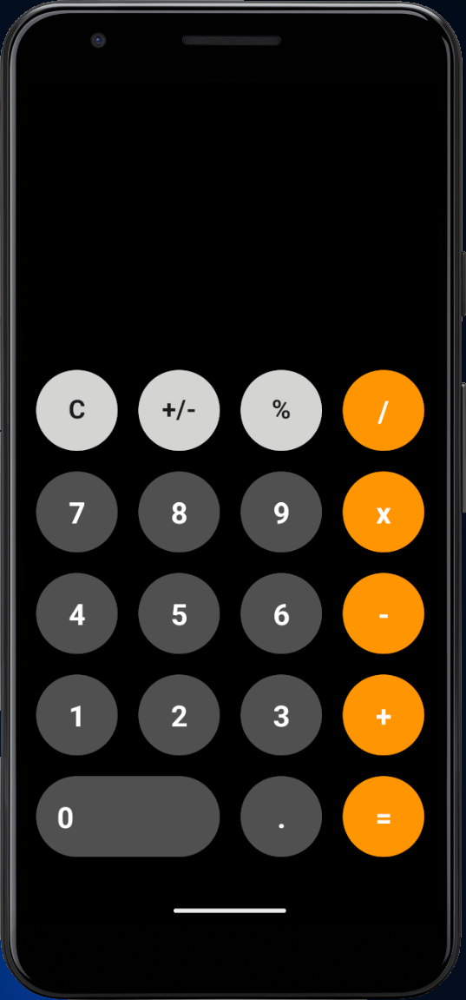
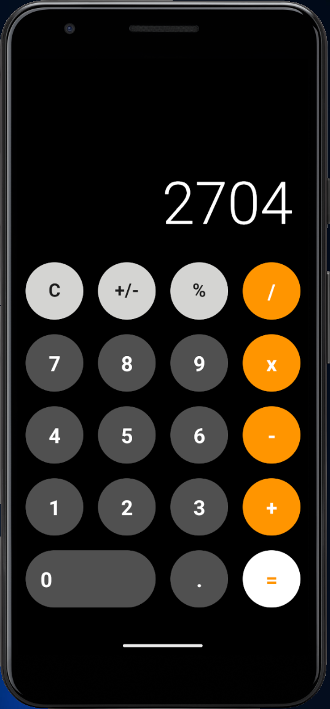

# Calculator App
A simple calculator app built using React Native.
## Features

- Basic arithmetic operations: addition, subtraction, multiplication, division, modulo-sum.
- Clear button to reset calculations.
- -/+ button for changing sign of desired number
- User-friendly interface based on IOS Calculator.

## Screenshots

  
  

